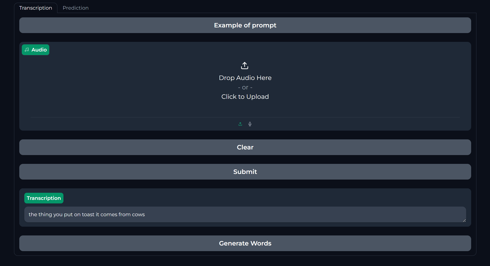
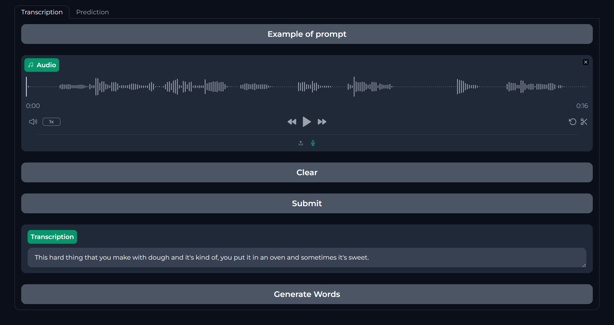
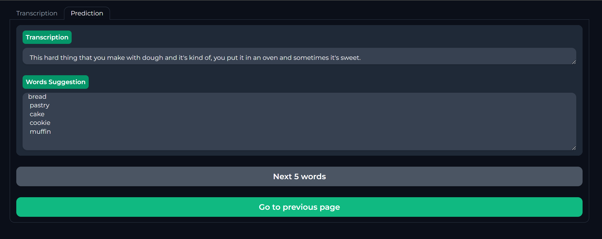

# Whatsit - Al Communication Assistant Tool

> This project was developed for the AI4Good Lab 2024 Project. 

Go to demo: [Webpage Demo](#demonstration) (click here)

## Overview
Whatsit is a Al communication assistant tool that aims to help those who suffer from aphasia regain their ability to communicate fluidly. This application predicts the word that people with aphasias cannot come up with, empowering communication of millions worldwide.

## Problem Statement
- **1 in 4 people will have a stroke within their lifetime**.
- **1 in 3 people who have a stroke will suffer from some form of aphasia**.
- Communication challenges include difficulties in reading, writing, understanding spoken language, and verbal communication.

## Stakeholder Consultation
- **McGill Outpatient Teaching Clinic, Chronic Aphasia Group**

### Key Takeaways
- Clean User Interface (UI)
- Multiple language input
- User-friendly experience

## Our Proposition
### Technologies Used
- **Voice Recognition**: OpenAI's Whisper
- **Language Model**: Meta's Llama3

### Future Directions
- Audio playback of the found word
- Ability to mark favorite words
- Image generation for the found word
- Support for multiple languages
- Image Database

## Contributors
- Mentor: [Owen He](https://www.linkedin.com/in/owen-he-b7b064279/)
- Teacher Assistant: [Krishna Maneesha Dendukuri](https://www.linkedin.com/in/krishna-maneeshad/)
- Team Members:
    -   [Elsana Kanybek](https://www.linkedin.com/in/elsanakanybek/)
    -   [Iris Wang](https://www.linkedin.com/in/iris-yiwei-wang/)
    -   [Sasha Nuttall](https://www.linkedin.com/in/sasha-nuttall-1x/)
    -   [Suhaylah Carim Bacor](https://www.linkedin.com/in/suhaylah-carim-bacor-31094a226/)
    -   [Em Hughes](https://www.linkedin.com/in/marie-hughes-812ab4309/)

## Demonstration
>This is the homepage. There is an option to have an example of prompt, uploading an audio, recording an audio.

>The recorded audio is going to have a text transcription for the user to verify their prompt before generating the words.

>When clicking on the "Generate Words" button, it will redirect to the second tab with the same text transcription and the words suggestion for the users. 

